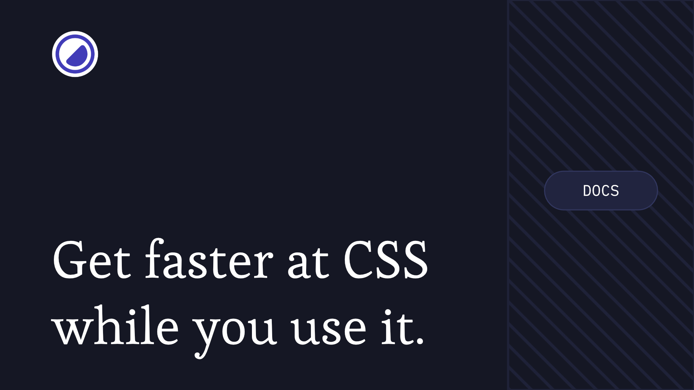

[](https://yummacss.com)

# yummacss.com

An atomic CSS framework.

Tiny atomic CSS driven utilities with fixed scales for spacing, colors, type and radius.

## Contributing

> [!NOTE]
> Please note that the following steps are only required in the event that you wish to contribute to the development of the software documentation or to address a software malfunction (bug).

To start the docs site in development mode, from the project root, run:

```bash
# install dependencies
pnpm i
# start development
pnpm d
```

This runs both the Next.js dev server and Yumma CSS in watch mode.

```bash
pnpm build
```

## Resources

Yumma CSS is part of a growing ecosystem of tools and complementary projects:

**[Yumma UI:](https://yummacss.com/ui)** A collection of ready-to-use UI components built with Base UI and styled with Yumma CSS.
<br/>
**[Yumma CSS Playground:](https://play.yummacss.com)** An interactive environment to experiment with Yumma CSS utilities right in your browser.
<br/>
**[Eclipsa:](https://marketplace.visualstudio.com/items?itemName=yumma-css.eclipsa)** A dark VS Code theme crafted for readability and style.

## License
