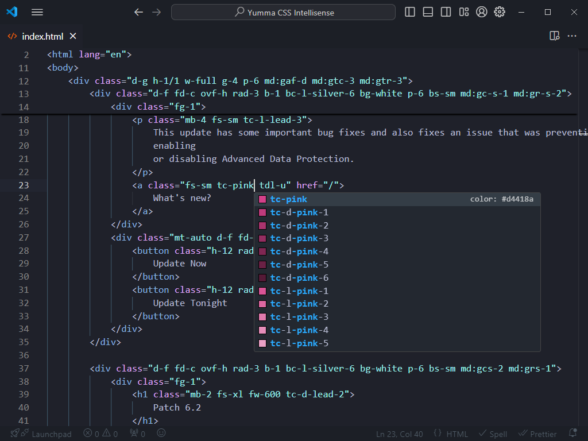
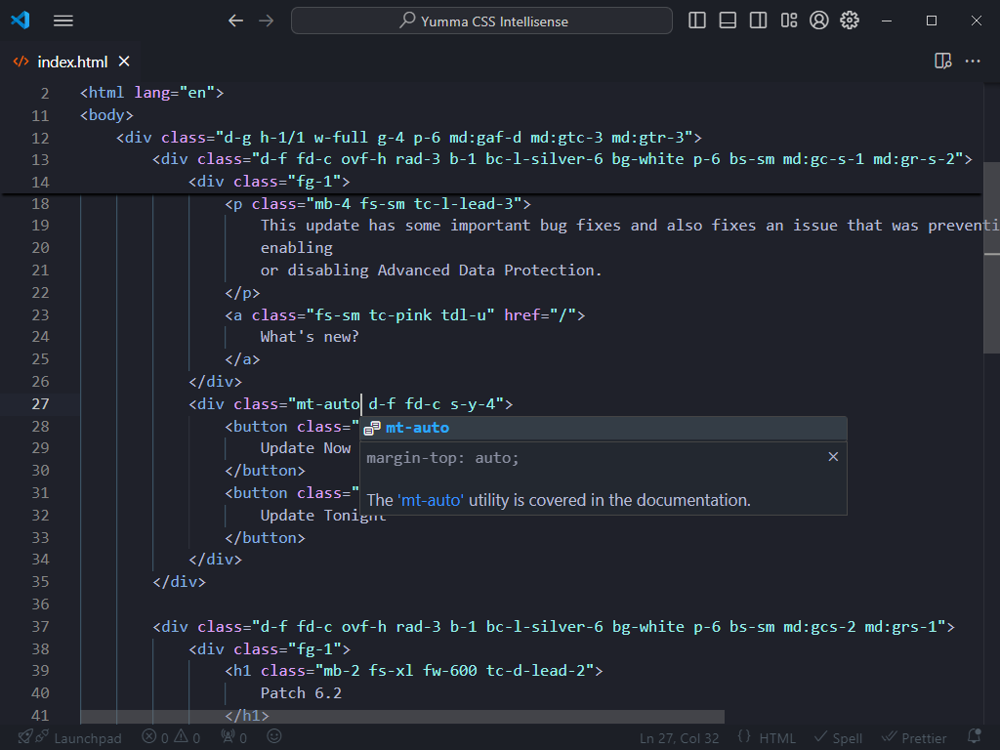
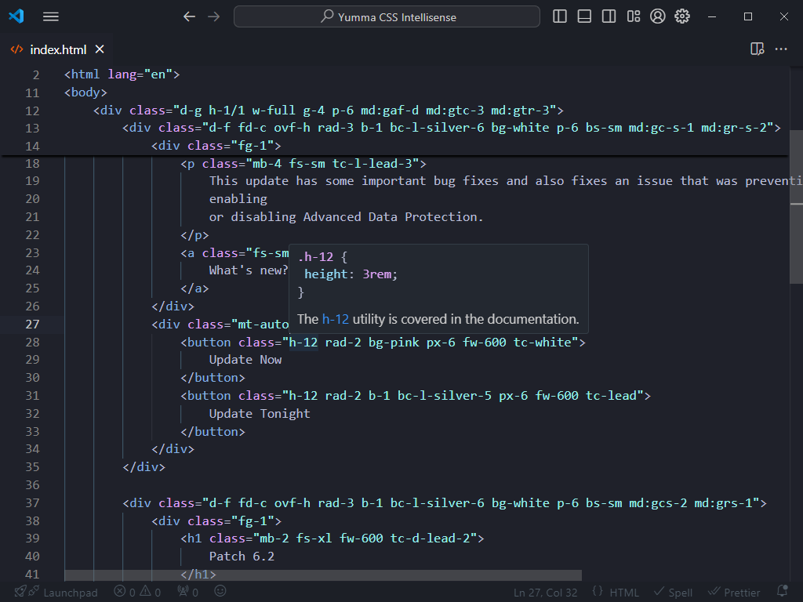

We've got some great news to share! The Yumma CSS Intellisense extension for Visual Studio Code is now available. Start coding with Yumma CSS VS Code integration today!

<iframe
  allowfullscreen
  allow="accelerometer; autoplay; clipboard-write; encrypted-media; gyroscope; picture-in-picture; web-share"
  class="ar-16/9 rad-1 w-full"
  frameborder="0"
  referrerpolicy="strict-origin-when-cross-origin"
  src="https://youtube.com/embed/MX65NiVYxYQ?si=s8meufbeDOxUE54l"
  title="What's new in Yumma CSS Play 0.1.0?"></iframe>

## What's in the box?

Here it is some features packaged with the extension:

- **Completions:** Helpful completions that can be accessed while typing.
- **Documentation**: Provides users with the opportunity to learn more about each completion.
- **Hovering:** Inspect the CSS behind the Yumma CSS classes.

Get [Yumma CSS Intellisense from the Visual Studio Marketplace](https://marketplace.visualstudio.com/items?itemName=yumma-css.yumma-css-intellisense).

---

## Completions

Get suggestions as you type, with information about their CSS properties and previews of the colors.

## Documentation

Take a closer look at the documentation with these helpful links.

## Hovering

Move your cursor over the name of a class to see each of its CSS properties.

## Community

Join the Yumma CSS community! Share your experiences and help Yumma CSS grow and be the best it can be.

<ShowcaseText
  entries={[
    {
      description: "If you experience any problems, please notify us at GitHub.",
      href: "https://github.com/yumma-lib/yumma-css/issues",
      title: "GitHub",
    },
    {
      description: "Join our Discord for discussion, sharing, and learning.",
      href: "https://discord.gg/2MUw2g6FCn",
      title: "Discord",
    },
    {
      description: "Please follow us on Twitter to receive the latest updates.",
      href: "https://twitter.com/yummacss",
      title: "Twitter",
    },
    {
      description: "For the latest updates, check out our YouTube walkthroughs.",
      href: "https://youtube.com/@yummacss",
      title: "YouTube",
    },
  ]}
/>
