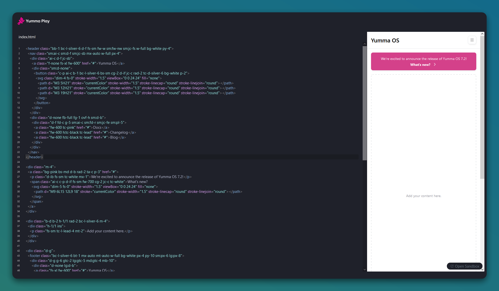

Yumma CSS Play a code editor on the web with Yumma CSS built in based on Sandpack. Create your own Yumma CSS components and see them in action right away in your browser of choice.

{/* excerpt */}

<ShowcaseYouTube
  entries={[
    {
      href: "https://youtu.be/Ayk8REhSOEA",
      title: "Introducing Yumma CSS Play",
    },
  ]}
/>

## What's in the box?

Here it is some features packaged with the extension:

- **Responsiveness**: Test responsiveness by resizing the preview panel.
- **Zero Configuration**: Just write some Yumma CSS, it's already installed!
- **Completions**: Helpful HTML tag completions.

Yumma CSS Play is powered by [Sandpack](https://codemirror.net), a code editor component for the web.

---

## Zero Configuration

All you have to do is write some Yumma CSS — it's already installed!

## Responsiveness

To test how responsive it is, just resize the preview panel.

## Completions

Get some helpful tips on using semantic HTML tags when you're writing.

