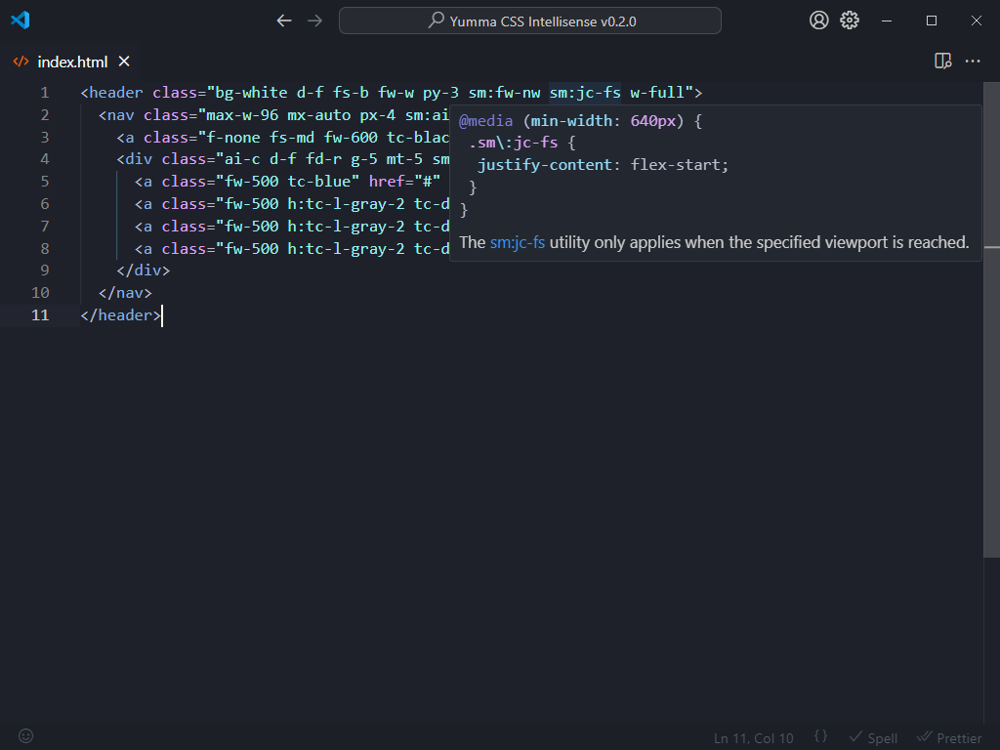
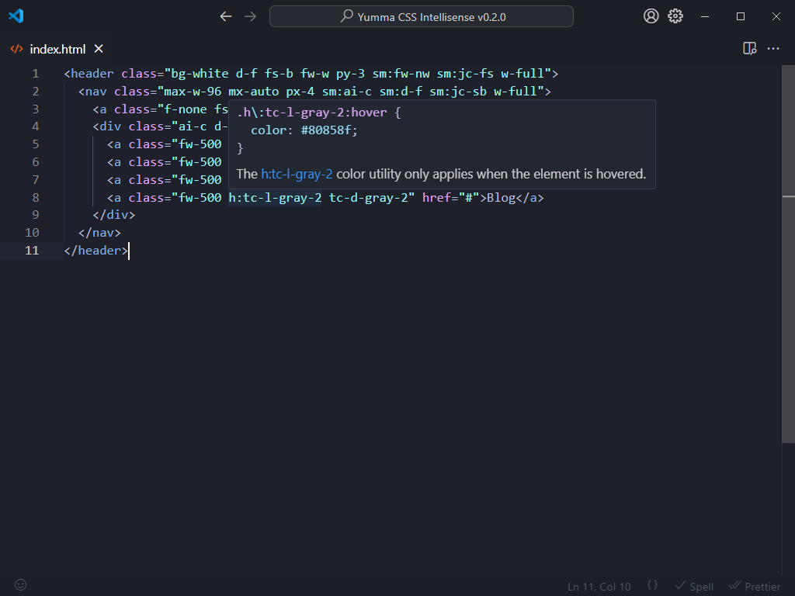

We're excited to announce the release of Yumma CSS Intellisense v0.2.0! You'll now be able to use hover providers for media queries and pseudo classes.

<iframe
  allowfullscreen
  allow="accelerometer; autoplay; clipboard-write; encrypted-media; gyroscope; picture-in-picture; web-share"
  class="ar-16/9 rad-1 w-full"
  frameborder="0"
  referrerpolicy="strict-origin-when-cross-origin"
  src="https://youtube.com/embed/n0tSAaHZTiw?si=AwWogjY861eJCqlt"
  title="What's new in Yumma CSS Intellisense 0.2.0?"></iframe>

You may also want to take a look at some of the [release notes](https://github.com/yumma-lib/yumma-css-intellisense/releases/tag/v0.2.0) but, anyway, these are the most noticeable shifts:

- [Media Queries](#media-queries): Add hover provider support to `sm:*`, `md:*`, `lg:*` and `xxl:*` variants
- [Pseudo Classes](#pseudo-classes): Add hover provider support to `h:*` variants

This is an incremental update that may contain bug fixes. Minor releases follow [semantic versioning](https://docs.npmjs.com/about-semantic-versioning) conventions. In other words, this should be an easy update for you.

---

## Media queries

If you hover over a media query utility variant, you'll see the utility class properties.

## Pseudo classes

The same goes for pseudo class utility variants like `h:*`.

## Community

Join the Yumma CSS community! Share your experiences and help Yumma CSS grow and be the best it can be.

<ShowcaseText
  entries={[
    {
      description: "If you experience any problems, please notify us at GitHub.",
      href: "https://github.com/yumma-lib/yumma-css/issues",
      title: "GitHub",
    },
    {
      description: "Join our Discord for discussion, sharing, and learning.",
      href: "https://discord.gg/2MUw2g6FCn",
      title: "Discord",
    },
    {
      description: "Please follow us on Twitter to receive the latest updates.",
      href: "https://twitter.com/yummacss",
      title: "Twitter",
    },
    {
      description: "For the latest updates, check out our YouTube walkthroughs.",
      href: "https://youtube.com/@yummacss",
      title: "YouTube",
    },
  ]}
/>
