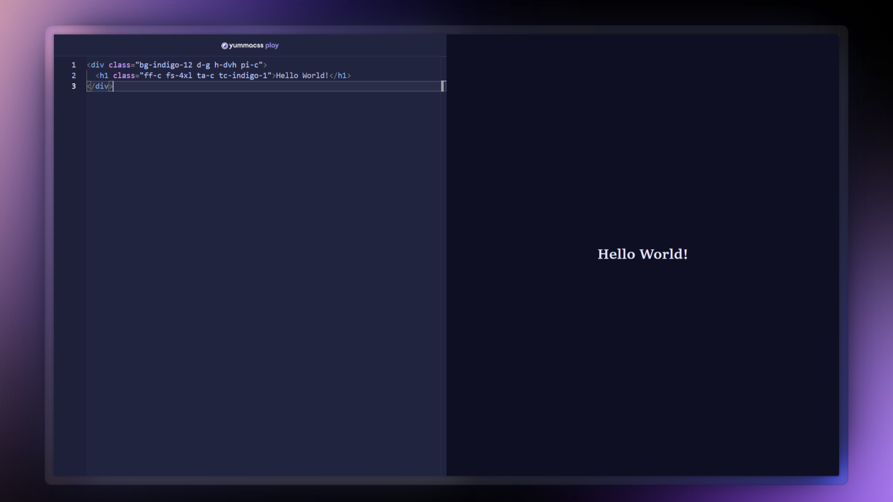
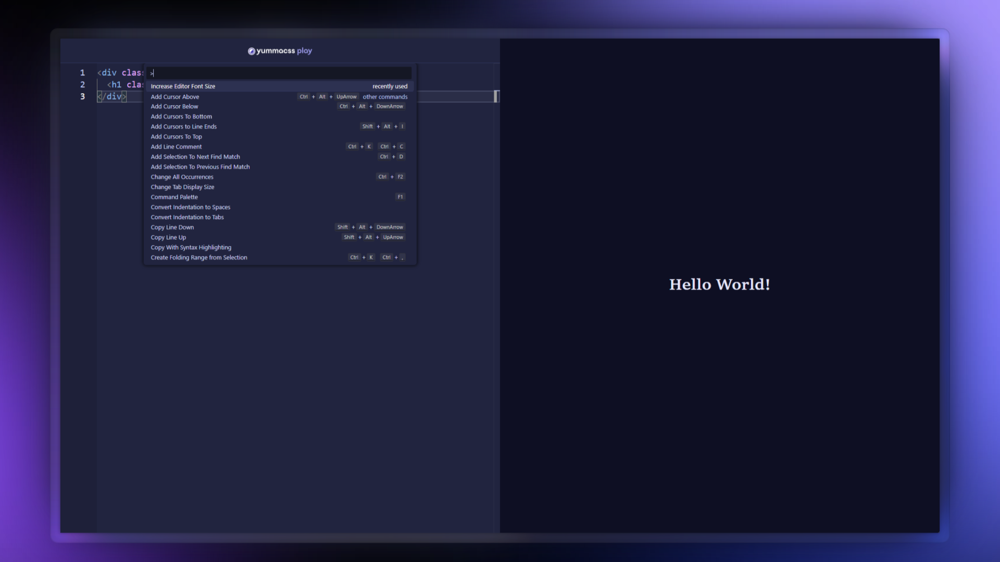
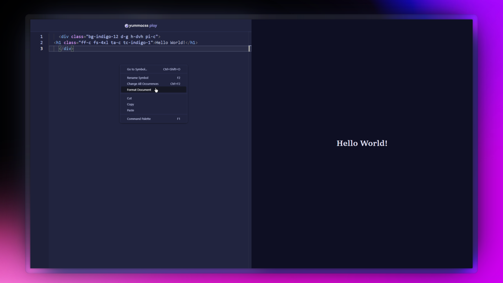

We've got another update on the Yumma CSS Playground. It's a small update, but it's got a lot of cool new features that we're excited to show you.

{/* excerpt */}

<iframe
  allowfullscreen
  allow="accelerometer; autoplay; clipboard-write; encrypted-media; gyroscope; picture-in-picture; web-share"
  class="ar-16/9 rad-1 w-full"
  frameborder="0"
  referrerpolicy="strict-origin-when-cross-origin"
  src="https://youtube.com/embed/xUQ3DW_J_3U?si=AwWogjY861eJCqlt"
  title="What's new in Yumma CSS Playground 0.1.1?"></iframe>

You may also want to take a look at some of the [release notes](https://github.com/yumma-lib/yumma-css-play/releases/tag/v0.1.1) but, anyway, these are the most noticeable shifts:

- [New Code Editor](#new-code-editor): Switched from CodeMirror to Monaco Editor
- [New Command palette](#new-command-palette): New VS Code-style command palette with F1
- [Emmet Support](#emmet-support): Full HTML emmet abbreviation support
- [Format Document](#format-document): New code formatting option

This is an incremental update that may contain bug fixes. Minor releases follow [semantic versioning](https://docs.npmjs.com/about-semantic-versioning) conventions. In other words, this should be an easy update for you.

---

## New Code Editor

It's a whole new code editor experience in this release! We've switched from CodeMirror 6 to Monaco Editor, the same powerful engine that drives VS Code.

## New Command Palette

It's hard to pick the coolest addition, but the new command palette is a strong contender. Press F1 to get instant access to useful actions and commands, just like in VS Code.

## Emmet Support

Additionally, we've added full Emmet abbreviation support for HTML. If you love using Emmet shortcuts to speed up your workflow, you're going to love this.

<iframe src="https://player.vimeo.com/video/1105646197?badge=0&amp;autopause=0&amp;player_id=0&amp;app_id=58479" frameborder="0" allow="autoplay; fullscreen; picture-in-picture; clipboard-write; encrypted-media; web-share" referrerpolicy="strict-origin-when-cross-origin" style="position:absolute;top:0;left:0;width:100%;height:100%;" title="What&#039;s new in Yumma CSS Play 0.1.1?"></iframe>

## Format Document

Forget unreadable bullshit code. We've added a formatting feature that you can access through the right-click context menu or by pressing Ctrl+S. Easy.

