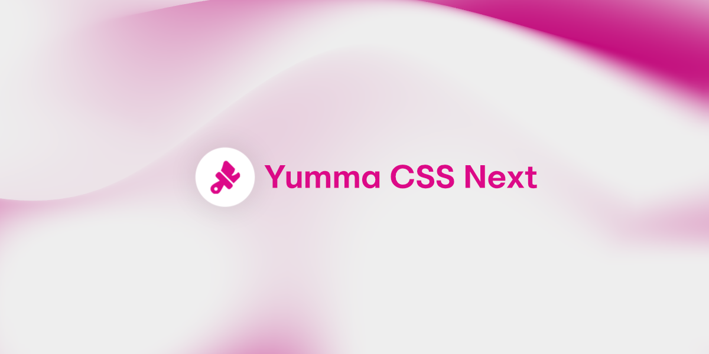

**Beta documentation**

It looks like you're just as excited as we are about what's to come in the next version of Yumma CSS! We can't wait to show you what we've got in store. Get ready, because the next version of Yumma CSS is going to be amazing!



<Aside title="WIP" type="caution">

This version is still a work in progress, as are the changes to this page. That means some of the core features and new ones might be updated, removed, or never make it to the main release.

</Aside>

## Yumma CSS CLI

Up until recently, the only way to use Yumma CSS was to import the compiled CSS into your main CSS file. As Yumma CSS is becoming more and more extensive, importing all its content at once might cause performance issues and slower loading times.

We're really excited to introduce Yumma CSS CLI, an awesome new way to create production-ready and fully optimized Yumma CSS projects.

### Dependency Changes

If you're planning on using the command-line interface feature, we suggest installing `yummacss` as a dev dependency. The reason is simple: we're now compiling SCSS from the `yummacss` package to our project to get the minimal amount of CSS possible.

```bash
npm i yummacss@latest --save-dev
```

The full set of utilities will be retained within the distribution folder for the purpose of facilitating the importation of the entire Yumma utilities suite, should this be required.

<FileTree>
	- dist
		- yumma.css
		- yumma.min.css
</FileTree>

### Upgrade from v2.1

The new CLI system lets you compile and get rid of any unused utilities you're not using in your Yumma CSS project, which means smaller CSS files and better performance.

<Steps>

    1. **Remove `@import` rules**

        The CLI works by compiling SCSS to CSS, so there's no need to import the Yumma CSS package dependency.

        ```diff lang="css" title="src/globals.css"
        - /* Minified Version */
        - @import "/node_modules/yummacss/dist/yumma.min.css";
        ```

    2. **Add the Yumma config file**

        Next, add the `yummacss.config.js` to the root level of your project.

        <FileTree>
            - public
                - favicon.ico
            - src
                - globals.css
                - page.html
            - .gitignore
            - package-lock.json
            - package.json
            - **yummacss.config.js** // Add the config file

        </FileTree>

    3. **Set up the config file**

        To allow the CLI command to scan your project files and build the CSS base in the output path, add the content array and output string field.

        ```js title="yummacss.config.js"
        export const config = {
            content: ["src/**/*.{html}"],
            output: "src/globals.css",
        };
        ```

    4. **Compile the SCSS**

        To compile the SCSS from to CSS, just run `npx yummacss build`. This command will only compile the used CSS that's been scanned in your project files each time you run the command. It'll also tree shake any unusable utilities in your code.

        ```bash title="Terminal"
        npx yummacss build
        ```

</Steps>

### Core Changes

From now on, core files like `yumma-core.css` and `yumma-core.min.css` will be deleted from the `/dist` folder in favor of the `yummacss.config.js` config file.

<Tabs>
  <TabItem icon="approve-check-circle" label="Now">
    ```js mark={4-7} title="yummacss.config.js"
    export const config = {
        content: ["src/**/*.{html}"],
        output: "src/globals.css",
        capabilities: {
            core: false, // Disable base styles
            minify: true, // Minifies CSS
        }
    };
    ```

  </TabItem>
  <TabItem icon="close" label="Previously">

    ```css title="src/globals.css"
    /* Disable base styles */
    @import "https://cdn.jsdelivr.net/gh/yumma-lib/yumma-css@latest/dist/yumma-core.css";

    /* Disable base styles and minify CSS */
    @import "https://cdn.jsdelivr.net/gh/yumma-lib/yumma-css@latest/dist/yumma-core.min.css";
    ```

  </TabItem>
</Tabs>

### Performance Boost

We completely overhauled the codebase to get better performance in build times and overall file size. We changing the way utilities and modifiers are generated, to eliminate any potential for duplicated or unnecessary data in the `/dist` folder.

| Metric               | v2.1    | v3.0 | Improvement |
| -------------------- | ------- | ---- | ----------- |
| Complete build       | 13.88 s | ???  | ???         |
| File size (standard) | 3.21 MB | ???  | ???         |
| File size (minified) | 2.48 MB | ???  | ???         |
| Utilities coverage   | 107     | 170  | +63         |

---

## New Colors

The colors are getting some big changes. We've gone from `10%` shade modification to `14%`. This means that light colors are going to be even lighter and dark colors are going to be even darker.

<Tabs>
  <TabItem icon="approve-check-circle" label="Now">
    <Palette
      percentage={14}
      data={[
        { name: "Red", color: "#d73d3d" },
        { name: "Orange", color: "#e06814" },
        { name: "Yellow", color: "#d3a107" },
        { name: "Green", color: "#1fb155" },
        { name: "Teal", color: "#12a695" },
        { name: "Cyan", color: "#05a4bf" },
        { name: "Blue", color: "#3575dd" },
        { name: "Indigo", color: "#595cd9" },
        { name: "Violet", color: "#7d53dd" },
        { name: "Pink", color: "#d4418a" },
        { name: "Lead", color: "#3f3f4e" },
        { name: "Gray", color: "#606773" },
        { name: "Silver", color: "#bfc2c7" },
      ]}
    />
  </TabItem>
  <TabItem icon="close" label="Previously">
    <Palette
      percentage={10}
      data={[
        { name: "Red", color: "#d73d3d" },
        { name: "Orange", color: "#e06814" },
        { name: "Yellow", color: "#d3a107" },
        { name: "Green", color: "#1fb155" },
        { name: "Teal", color: "#12a695" },
        { name: "Cyan", color: "#05a4bf" },
        { name: "Blue", color: "#3575dd" },
        { name: "Indigo", color: "#595cd9" },
        { name: "Violet", color: "#7d53dd" },
        { name: "Pink", color: "#d4418a" },
        { name: "Lead", color: "#3f3f4e" },
        { name: "Gray", color: "#606773" },
        { name: "Silver", color: "#bfc2c7" },
      ]}
    />
  </TabItem>
</Tabs>

## All-new Utilities

To make the Yumma CSS framework as complete as possible, we're adding support for over 60 utility classes to the core of the framework.

**Backgrounds**

- [x] Background Attachment
- [x] Background Clip
- [x] Background Origin
- [x] Background Position
- [x] Background Repeat
- [x] Background Size

**Borders**

- [x] Border Spacing

**Box Model**

- [x] Margin Block End
- [x] Margin Block Start
- [x] Margin Inline End
- [x] Margin Inline Start
- [x] Padding Block End
- [x] Padding Block Start
- [x] Padding Inline End
- [x] Padding Inline Start
- [x] Place Content
- [x] Place Items
- [x] Place Self

**Flexbox**

- [x] Order

**FX**

- [x] Blur
- [x] Box Decoration Break
- [x] Grayscale

**Interaction**

- [x] Scroll Behavior
- [x] Scroll Margin
- [x] Scroll Margin Bottom
- [x] Scroll Margin Inline End
- [x] Scroll Margin Inline Start
- [x] Scroll Margin Left
- [x] Scroll Margin Right
- [x] Scroll Margin Top
- [x] Scroll Margin X
- [x] Scroll Margin Y
- [ ] Scroll Padding
- [ ] Scroll Padding Bottom
- [ ] Scroll Padding Inline End
- [ ] Scroll Padding Inline Start
- [ ] Scroll Padding Left
- [ ] Scroll Padding Right
- [ ] Scroll Padding Top
- [ ] Scroll Padding X
- [ ] Scroll Padding Y
- [ ] Scroll Snap Align
- [ ] Scroll Snap Stop
- [ ] Scroll Snap Type

**Layout**

- [x] Clear
- [ ] Direction (.dir-i-x, .dir-i-y)
- [x] Isolation

**SVG**

- [x] Fill
- [ ] Stroke
- [ ] Stroke Width

**Text**

- [ ] Text Indent
- [ ] Text Overflow
- [ ] Text Transform
- [ ] Text Underline Offset
- [ ] Text Wrap
- [ ] Transform Origin
- [ ] Transition Delay
- [ ] Transition Duration
- [ ] Transition Property
- [ ] Vertical Align
- [ ] Whitespace

**Typography**

- [ ] Letter Spacing
- [ ] List Style Position

## Goodbye Inset

We're removing the ins utility class from Yumma. It's been a great ride, and I'm sure it helped most of you easily center a div in the center of the screen. But to keep things modern and flexible, this concept doesn't fit in the framework, so we've decided to remove it.

## Syntax Changes

We're making Yumma CSS even more concise with the utility classes to keep everything minimal. Here are some of the new changes we've got planned:

### Dimension

<Tabs>
  <TabItem icon="approve-check-circle" label="Now">
    <Utility
      additionalClasses={[
        { name: "1/1", value: "100dvh" },
        { name: "1/2", value: "50dvh" },
        { name: "auto", value: "auto" },
        { name: "fc", value: "fit-content" },
        { name: "full", value: "100%" },
        { name: "half", value: "50%" },
        { name: "max", value: "max-content" },
        { name: "min", value: "min-content" },
      ]}
      classPrefix="d-"
      incrementValue={0.25}
      propNames={["height", "width"]}
      range={100}
      unit="rem"
    />

  </TabItem>
  <TabItem icon="close" label="Previously">
    <Utility
      additionalClasses={[
        { name: "1/1", value: "100dvh" },
        { name: "1/2", value: "50dvh" },
        { name: "auto", value: "auto" },
        { name: "fc", value: "fit-content" },
        { name: "full", value: "100%" },
        { name: "half", value: "50%" },
        { name: "max", value: "max-content" },
        { name: "min", value: "min-content" },
      ]}
      classPrefix="dim-"
      incrementValue={0.25}
      propNames={["height", "width"]}
      range={100}
      unit="rem"
    />
  </TabItem>
</Tabs>

### Max Dimension

<Tabs>
  <TabItem icon="approve-check-circle" label="Now">
    <Utility
      additionalClasses={[
        { name: "1/1", value: "100dvh" },
        { name: "1/2", value: "50dvh" },
        { name: "auto", value: "auto" },
        { name: "fc", value: "fit-content" },
        { name: "full", value: "100%" },
        { name: "half", value: "50%" },
        { name: "max", value: "max-content" },
        { name: "min", value: "min-content" },
      ]}
      classPrefix="max-d-"
      incrementValue={0.25}
      propNames={["max-height", "max-width"]}
      range={100}
      unit="rem"
    />

  </TabItem>
  <TabItem icon="close" label="Previously">
    <Utility
      additionalClasses={[
        { name: "1/1", value: "100dvh" },
        { name: "1/2", value: "50dvh" },
        { name: "auto", value: "auto" },
        { name: "fc", value: "fit-content" },
        { name: "full", value: "100%" },
        { name: "half", value: "50%" },
        { name: "max", value: "max-content" },
        { name: "min", value: "min-content" },
      ]}
      classPrefix="max-dim-"
      incrementValue={0.25}
      propNames={["max-height", "max-width"]}
      range={100}
      unit="rem"
    />
  </TabItem>
</Tabs>

### Min Dimension

<Tabs>
  <TabItem icon="approve-check-circle" label="Now">
    <Utility
      additionalClasses={[
        { name: "1/1", value: "100dvh" },
        { name: "1/2", value: "50dvh" },
        { name: "auto", value: "auto" },
        { name: "fc", value: "fit-content" },
        { name: "full", value: "100%" },
        { name: "half", value: "50%" },
        { name: "max", value: "max-content" },
        { name: "min", value: "min-content" },
      ]}
      classPrefix="min-d-"
      incrementValue={0.25}
      propNames={["min-height", "min-width"]}
      range={100}
      unit="rem"
    />

  </TabItem>
  <TabItem icon="close" label="Previously">
    <Utility
      additionalClasses={[
        { name: "1/1", value: "100dvh" },
        { name: "1/2", value: "50dvh" },
        { name: "auto", value: "auto" },
        { name: "fc", value: "fit-content" },
        { name: "full", value: "100%" },
        { name: "half", value: "50%" },
        { name: "max", value: "max-content" },
        { name: "min", value: "min-content" },
      ]}
      classPrefix="min-dim-"
      incrementValue={0.25}
      propNames={["min-height", "min-width"]}
      range={100}
      unit="rem"
    />
  </TabItem>
</Tabs>

### Spacing X

<Tabs>
  <TabItem icon="approve-check-circle" label="Now">
    <Utility
      classPrefix="sx-"
      incrementValue={0.25}
      propNames={["margin-left", "margin-right"]}
      range={100}
      unit="rem"
    />

  </TabItem>
  <TabItem icon="close" label="Previously">
    <Utility
      classPrefix="s-x-"
      incrementValue={0.25}
      propNames={["margin-left", "margin-right"]}
      range={100}
      unit="rem"
    />
  </TabItem>
</Tabs>

### Spacing Y

<Tabs>
  <TabItem icon="approve-check-circle" label="Now">
    <Utility
      classPrefix="sy-"
      incrementValue={0.25}
      propNames={["margin-bottom", "margin-top"]}
      range={100}
      unit="rem"
    />

  </TabItem>
  <TabItem icon="close" label="Previously">
    <Utility
      classPrefix="s-y-"
      incrementValue={0.25}
      propNames={["margin-bottom", "margin-top"]}
      range={100}
      unit="rem"
    />
  </TabItem>
</Tabs>